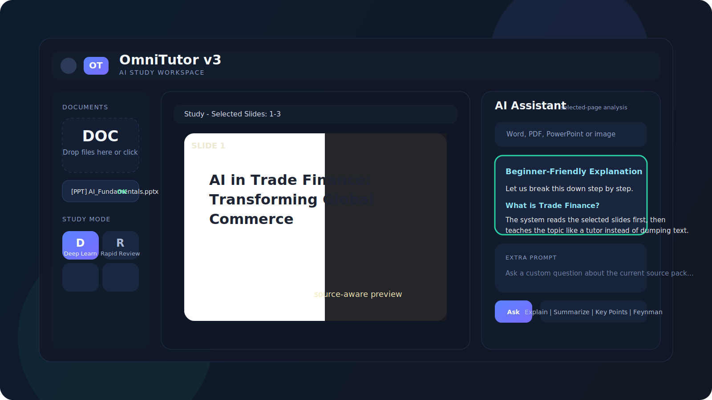
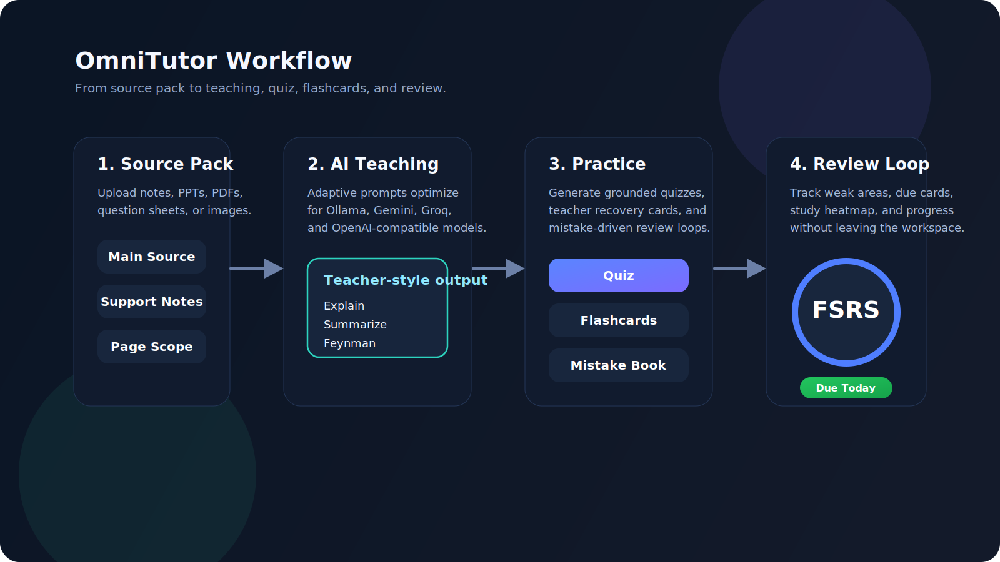

# OmniTutor v3

Document-grounded AI study workspace with grounded chat, selected-page study, teacher question packs, quizzes, flashcards, recovery review, and multi-provider AI.

OmniTutor is built to stay source-aware. The app reads your uploaded material first, then uses the selected source pack to teach, quiz, review, and explain without drifting away from the documents you chose.



## What it does

- Document-grounded chat from your uploaded files
- Study mode with page or slide selection
- Teacher question packs from `DOCX`, `PDF`, images, and presentations
- Quiz generation with support-source packs
- Flashcards with recovery decks and review flow
- Progress dashboard, weak areas, and review queue
- Local-first AI support:
  - `Ollama`
  - `Gemini`
  - `Groq`
  - `OpenAI-compatible`
  - `DeepSeek`
- UI locale support:
  - Turkish
  - English
  - Russian
  - Korean

## Product surfaces



## Run locally

### Option 1: Node.js

Requirements:

- Node.js 18+

Install and run:

```powershell
git clone https://github.com/DommLee/study_app.git
cd study_app
npm install
copy .env.example .env
npm start
```

Open:

```text
http://localhost:3030
```

### Option 2: Docker

Requirements:

- Docker Desktop

Run:

```powershell
git clone https://github.com/DommLee/study_app.git
cd study_app
copy .env.example .env
docker compose up --build -d
```

Open:

```text
http://localhost:3030
```

## AI setup

Inside the app:

1. Open `Settings`
2. Choose an AI provider
3. Enter your own API key if that provider needs one
4. Or select `Ollama` and point to your local instance
5. Test the connection
6. Save

Default local Ollama URL:

```text
http://localhost:11434
```

## Supported files

- `PDF`
- `DOCX`
- `TXT`
- `MD`
- `PNG`
- `JPG`
- `WEBP`
- `PPT`
- `PPTX`

## Creator

- Name: `Abdullah Yildiz`
- GitHub: [DommLee](https://github.com/DommLee)
- Email: [Abdullahyldxz@gmail.com](mailto:Abdullahyldxz@gmail.com)
- Instagram: [_abdlhyldxz](https://instagram.com/_abdlhyldxz)

## Important product notes

- GitHub Pages can host the static project site and documentation, but not the full app backend.
- The full OmniTutor application requires the Node.js server because uploads, indexing, OCR, question extraction, and AI routing run on the backend.
- The Pages site included in this repo is a static showcase and setup guide.

## Security notes

- Do not commit `.env`
- Do not commit `data/`
- Do not commit local provider keys
- Rotate any API key that has ever been stored in a shared file or screenshot

## Project structure

```text
study_app/
|-- docs/                  # Static project site for GitHub Pages
|-- lib/                   # Prompt engine, context builder, review engine
|-- prompts/               # Adaptive prompt templates
|-- public/                # Frontend assets
|-- data/                  # Local runtime state (ignored)
|-- uploads/               # Temporary upload area (ignored)
|-- server.js              # Main backend
|-- package.json
|-- docker-compose.yml
|-- Dockerfile
|-- start.bat
`-- .env.example
```

## GitHub Pages

This repo includes a static landing page under `docs/` and a Pages workflow under `.github/workflows/pages.yml`.

If Pages is enabled for the repository, the site will publish from GitHub Actions automatically after push.

Expected URL:

```text
https://dommlee.github.io/study_app/
```

## License

See [LICENSE](LICENSE).
